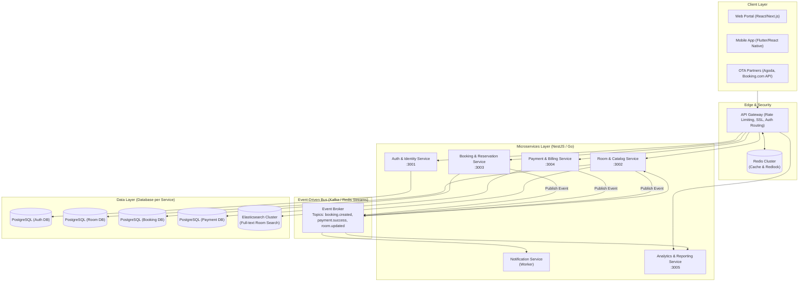
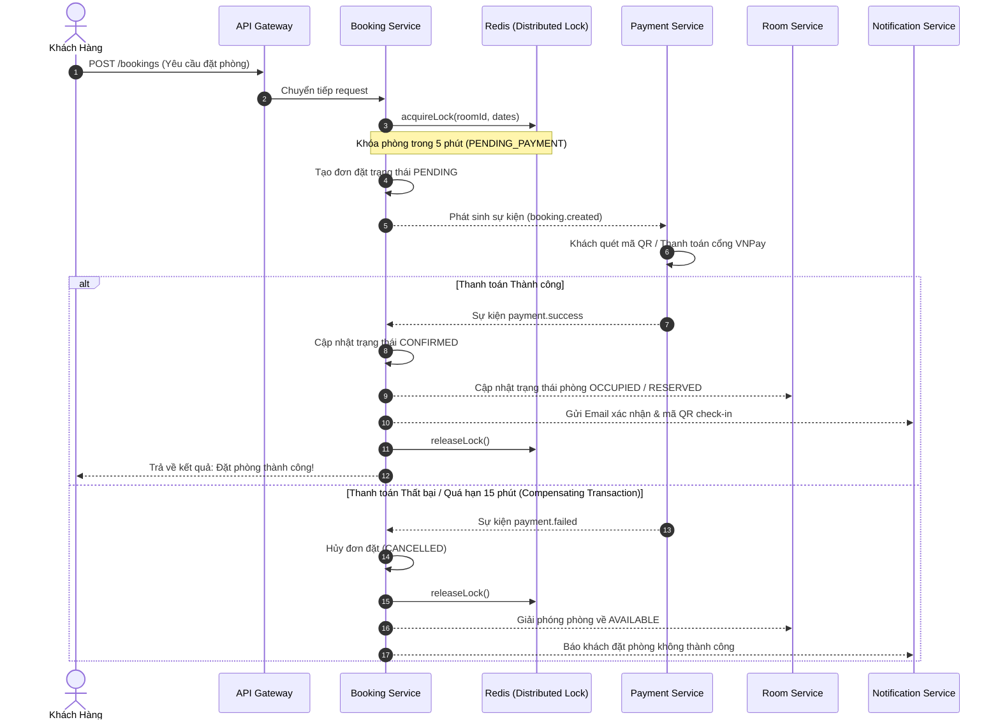

# Kiến Trúc Microservices Chuyên Sâu - Hệ Thống Quản Lý Khách Sạn (PA1)

Tài liệu này đặc tả thiết kế kiến trúc phân tán (**Microservices Architecture**) cho hệ thống Quản lý Khách sạn & Chuỗi Resort quy mô lớn, chịu tải cao (High Concurrency & High Availability).

---

## 1. Sơ Đồ Kiến Trúc Tổng Thể (System Architecture)

---

## 2. Phân Rã Dịch Vụ Theo Domain-Driven Design (DDD)

Áp dụng nguyên tắc **Database-per-Service** (Mỗi dịch vụ sở hữu cơ sở dữ liệu riêng, không chia sẻ database trực tiếp):

| Tên Dịch Vụ (Service) | Trách Nhiệm Chính | Công Nghệ Khuyến Nghị | Database |
| :--- | :--- | :--- | :--- |
| **API Gateway** | Routing, xác thực JWT tập trung, Rate Limiter (Redis), Load balancing | NestJS / Kong / Traefik | Redis |
| **Auth & Identity Service** | Quản lý User, cấp phát JWT, phân quyền RBAC (`ADMIN`, `RECEPTIONIST`, `CASHIER`, `CUSTOMER`) | NestJS + Passport | PostgreSQL |
| **Room & Catalog Service** | Danh mục phòng, bảng giá theo mùa, đồng bộ Elasticsearch, quản lý trạng thái dọn dẹp/bảo trì | NestJS / Go | PostgreSQL + Elasticsearch |
| **Booking Service** | Đặt phòng, giữ chỗ, kiểm tra xung đột lịch, Redis Distributed Lock | NestJS | PostgreSQL + Redis (Redlock) |
| **Payment & Billing Service** | Tích hợp VNPay, MoMo, Stripe, xử lý xuất hóa đơn, hoàn tiền khi hủy phòng | NestJS / Spring Boot | PostgreSQL |
| **Notification Service** | Gửi Email xác nhận đặt phòng, SMS thông báo OTP, WebSocket thông báo Lễ tân | Node.js Worker | Redis Queue (BullMQ) |
| **Analytics Service** | Tổng hợp KPIs, tỷ lệ lấp đầy, tính toán doanh thu | NestJS / Python FastAPI | PostgreSQL / ClickHouse |

---

## 3. Quản Lý Giao Dịch Phân Tán (Saga Pattern)

Khi tách thành Microservices, một hành động đặt phòng kèm thanh toán trải qua nhiều service khác nhau. Để đảm bảo tính toàn vẹn (Data Consistency) mà không bị khóa chết hệ thống (Avoid 2PC Deadlocks), hệ thống áp dụng **Saga Pattern (Choreography/Orchestration)**:

---

## 4. Cơ Chế Chống Double-Booking Tuyệt Đối (Redis Distributed Lock)

### Vấn đề:
Khi mở bán các dịp lễ Tết, hàng trăm khách hàng có thể cùng bấm nút **Đặt phòng** cho 1 phòng Suite duy nhất trong cùng 1 phần trăm giây. Nếu chỉ dùng SQL `SELECT ... WHERE`, hiện tượng **Race Condition** sẽ khiến cả 2 người cùng đặt được 1 phòng (Double Booking).

### Giải pháp kỹ thuật đã triển khai:
1. Sử dụng lệnh nguyên tử của Redis: `SET lock:room:{roomId}:{dates} {lockToken} NX PX {ttlMs}`.
   - `NX`: Chỉ thiết lập nếu key chưa tồn tại.
   - `PX`: Hết hạn tự động sau `{ttlMs}` (phòng trường hợp server bị sập đột ngột không kịp mở khóa).
2. Khi giải phóng khóa, sử dụng **Lua script** để so sánh `lockToken` trước khi xóa, tránh tình trạng Request A xóa nhầm lock của Request B khi request A bị timeout trễ.

---

## 5. Chiến Lược Tìm Kiếm Siêu Tốc (Elasticsearch)

1. **Mapping**: Chỉ mục `hotel_rooms` lưu thông tin phòng, tiện ích dạng đa trường (multi-field keyword + text).
2. **Fuzzy Search**: Cho phép khách gõ sai chính tả nhẹ (vd: `vilas` -> vẫn tìm thấy `Villa`, `bien` -> tìm thấy `hướng biển`).
3. **Multi-field Boosting**:
   - Tên loại phòng được nhân trọng số x3 (`roomTypeName^3`).
   - Mô tả phòng nhân trọng số x2 (`description^2`).
   - Lọc chính xác tiện ích (`amenities: ["Wifi", "Bồn tắm"]`).
4. **Đồng bộ dữ liệu (Change Data Capture)**:
   - Bất cứ khi nào phòng được thêm mới, cập nhật giá hoặc trạng thái trên PostgreSQL, Service tự động đẩy bản ghi cập nhật lên Elasticsearch Cluster.

---

## 6. Lộ Trình Triển Khai Thực Tế

1. **Giai đoạn 1 (Hiện tại - Modular Monolith)**:
   - Các module tách biệt rõ ràng (`Auth`, `Rooms`, `Bookings`, `Invoices`, `Analytics`).
   - Tích hợp Redis Caching + Distributed Lock.
   - Tích hợp Elasticsearch Full-Text Search.
2. **Giai đoạn 2 (Tách Dịch vụ độc lập)**:
   - Tạo Repository riêng cho từng Service.
   - Triển khai API Gateway (NestJS Gateway / Kong).
   - Đưa RabbitMQ hoặc Kafka vào làm Message Broker giữa các dịch vụ.
3. **Giai đoạn 3 (Production Kubernetes)**:
   - Đóng gói Docker container cho từng Service.
   - Triển khai trên Kubernetes (EKS/GKE) với Auto-scaling (HPA).
   - Cài đặt Prometheus & Grafana giám sát hiệu năng, Jaeger theo dõi Distributed Tracing.
